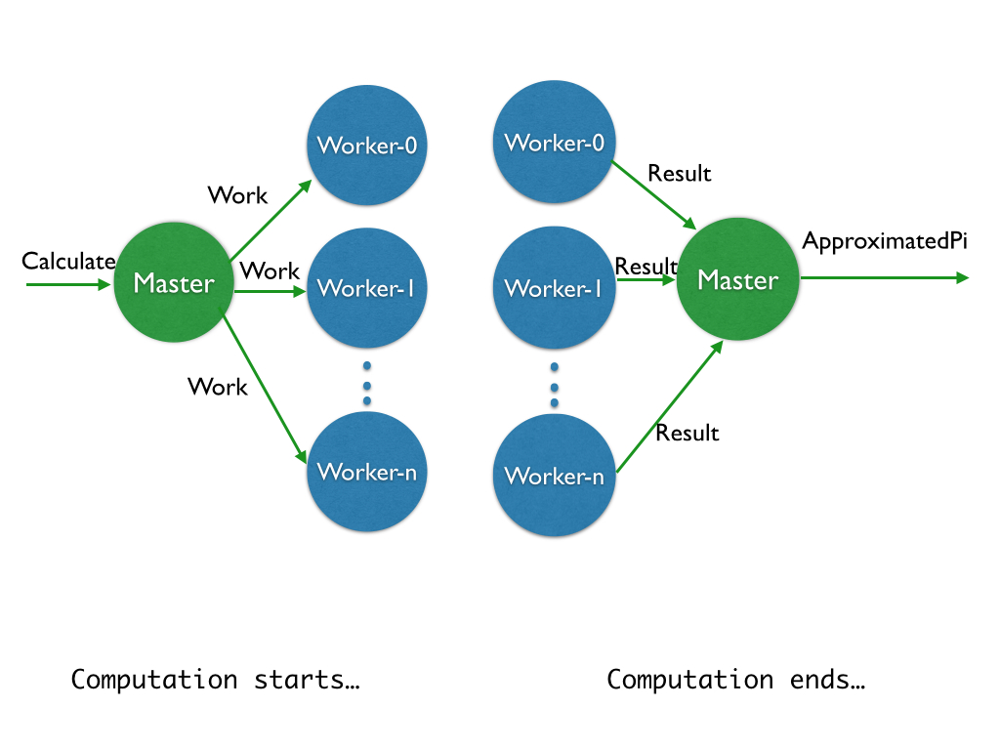

Akka Batching Example
---

Overview
---
The purpose of this page is to give an overview of how we could use the Akka framework to implement batching and improve performance of the 'user activity vault' service.

Akka is a toolkit and runtime for building highly concurrent, distributed, and fault tolerant event-driven applications on the JVM.
It has the following key attributes :

**Simple Concurrency & Distribution**

Asynchronous and Distributed by design. 

High-level abstractions like Actors, Futures and STM

**Resilient by Design**

Write systems that self-heal. 

Remote and/or local supervisor hierarchies.

**High Performance**

50 million msg/sec on a single machine. 

Small memory footprint; ~2.5 million actors per GB of heap.

**Elastic & Decentralized**

Adaptive load balancing, routing, partitioning and configuration-driven remoting.

**Extensible**

Use Akka Extensions to adapt Akka to fit your needs.

Basic Architecture
---

Actors are very lightweight concurrent entities. They process messages asynchronously using an event-driven receive loop. 

* Each actor is essentially a single, asynchronous (non-blocking) worker "thread"

* Each actor has a mailbox (or queue) of incoming messages, which it processes one at a time, in order
 
* As the actor is single threaded you can reason about concurrency more clearly, without having to worry about thread-synchonizaton or locks

